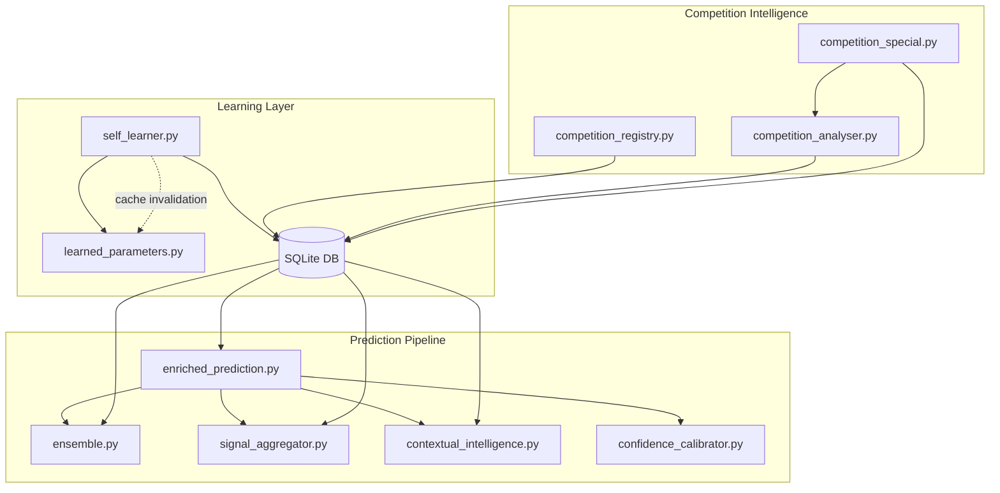
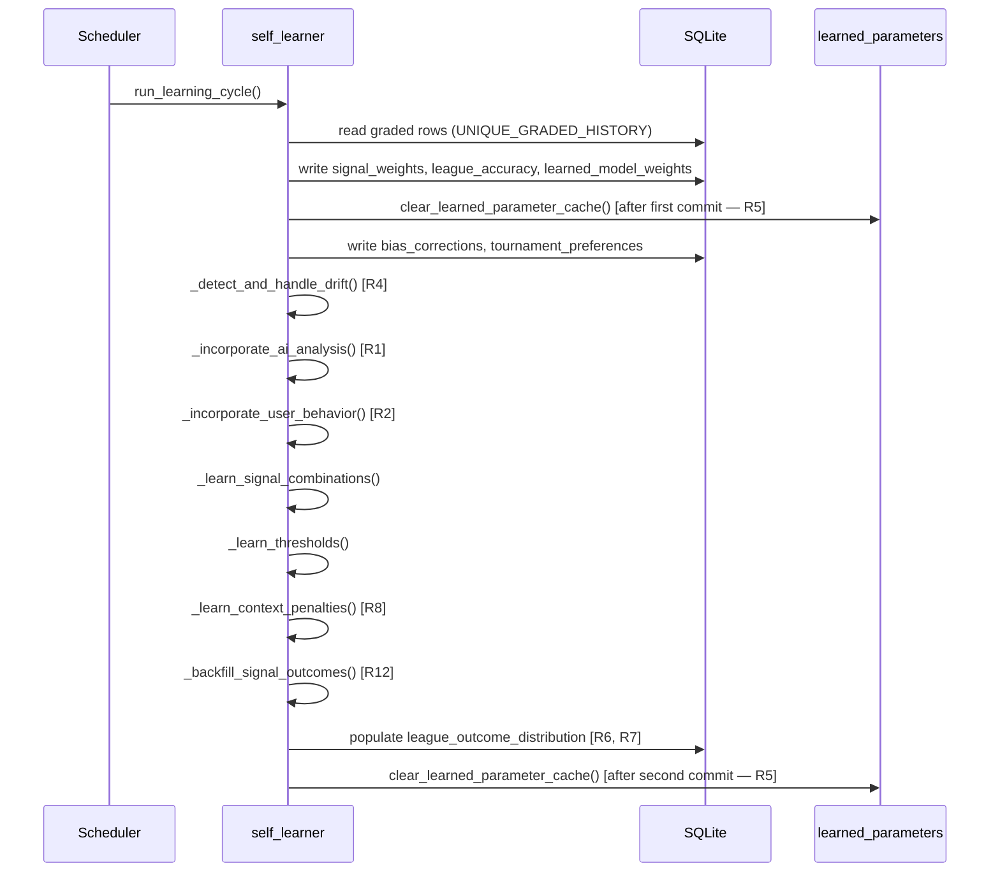
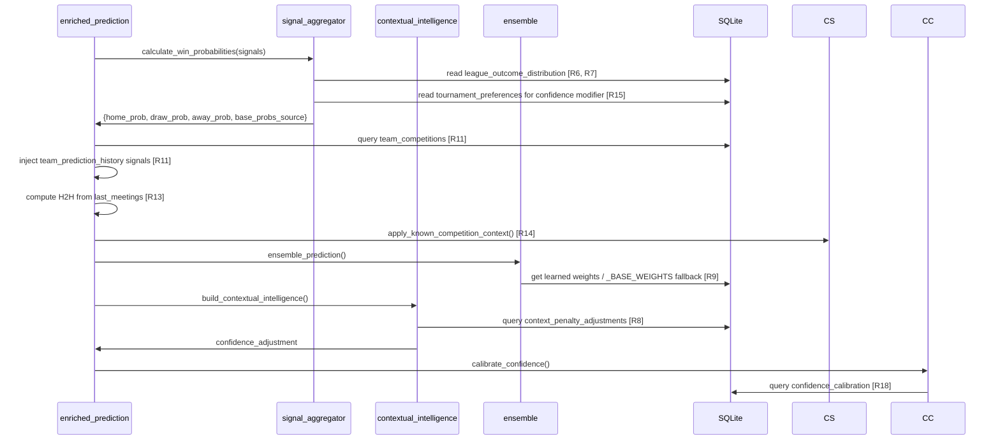

# Design Document — Prediction Intelligence Overhaul

## Overview

This document describes the technical design for a comprehensive overhaul of the prediction intelligence system. The work addresses four categories of defects:

1. **Critical stubs and broken feedback loops** — `_incorporate_ai_analysis` and `_incorporate_user_behavior` currently return 0 and accumulate no learning value.
2. **Hard-coded numeric biases** — away baselines, mixed-signal base probabilities, context penalties, and confidence calibration bands use constants that should be learned from data.
3. **Incomplete wiring** — team and competition intelligence tables exist but are not connected to the live prediction pipeline.
4. **Signal-quality and cache hygiene gaps** — deduplication, drift detection, cache TTL, and cache size bounds are absent or incomplete.

The 18 requirements span six primary source files: `signal_aggregator.py`, `self_learner.py`, `ensemble.py`, `learned_parameters.py`, `contextual_intelligence.py`, `enriched_prediction.py`, `confidence_calibrator.py`, and two competition modules.

---

## Architecture

### System Context



### Data Flow: Learning Cycle



### Data Flow: Prediction Time



---

## Components and Interfaces

### R1 — AI Analysis Feedback Loop (`self_learner.py`)

Replaces the `_incorporate_ai_analysis` stub.

**Algorithm:**
1. For each graded row, derive `competition_key` from `league_name` via `_norm_league()`, and extract `round_name` from `audit_json` if available.
2. Query `competition_analysis` for the most recent row matching `competition_key` within 30 days.
3. Parse `analysis_text` (JSON) to extract `top_table` — the team listed in position 1 represents the AI's predicted confidence direction (home if the home team is rank 1, away if away team is rank 1).
4. Compare direction against `row["selection"]` to determine `analysis_correct`.
5. Upsert into `ai_analysis_feedback` using `ON CONFLICT(match_id, competition_key) DO NOTHING` to preserve original writes.
6. When `ai_analysis_feedback` has >= 10 rows: compute `ai_win_rate = SUM(analysis_correct) / COUNT(*)`, apply the standard model weight blend formula, upsert `learned_model_weights` for `model_name = 'llm'`.
7. Return count of upserted rows.

**Guard:** If `competition_analysis` table does not exist (sqlite3.OperationalError), catch and return 0.

---

### R2 — User Behavior Feedback Loop (`self_learner.py`)

Replaces the `_incorporate_user_behavior` stub.

**Algorithm:**
1. Iterate graded rows, parse `signals_json`, filter for signal where `name == 'user_pick_signal'`.
2. Extract `impact` from the signal to determine `user_agreed` (1 if impact > 0, else 0).
3. Upsert into `user_behavior_outcomes` using `ON CONFLICT(match_id, pick_type) DO NOTHING`.
4. After upsert batch:
   - If `SUM(user_agreed=1) >= 15`: compute `agree_win_rate`, write to a `user_behavior_calibration` row in `learned_model_weights` using formula `round((agree_win_rate - 0.5) * 8, 1)` clamped to `[0, 6]`.
   - If `SUM(user_agreed=0) >= 15`: compute `disagree_win_rate`, write `round((0.5 - disagree_win_rate) * 4, 1)` clamped to `[-4, 0]`.
5. Return count of rows written to `user_behavior_outcomes`.

---

### R3 — Signal Deduplication (`signal_aggregator.py`)

**Change in `add_signals()`:**
- After converting each signal to normalized form, build a `category → (strength, signal)` map keyed by `category`.
- For each incoming signal, group by `(category, source)`. Within the same source, allow all signals through (dedup is cross-source only). Across sources: for each category, retain only the signal with the highest `abs(strength)`.
- Add `_dropped_duplicates: int = 0` instance attribute, initialized in `__init__`.
- Increment `_dropped_duplicates` for each discarded signal.
- Log at DEBUG level: `"[signal_aggregator] dedup: category={category} dropped={dropped_sources} kept={kept_name}"`.

**Change in `calculate_probabilities()`:**
- Add `"dropped_duplicate_count": self._dropped_duplicates` to the returned dict.

---

### R4 — Drift Detection (`self_learner.py`)

New function `_detect_and_handle_drift(conn, rows)` called after `update_tournament_preferences()` (step 4) in `run_learning_cycle()`.

**Algorithm:**
1. Filter rows to those from the last 7 calendar days (`created_at >= now - 7 days`).
2. Group by `(league_key, pick_type)`. For each group with `len >= 10`:
   - Compute `win_rate = wins / total`.
   - If `win_rate < 0.40`: set drift; if already had `priority = 7` from drift and `win_rate >= 0.45`: set recovery.
3. **On drift:** `UPDATE tournament_preferences SET priority = 7 WHERE league_key = ?`. Insert `system_events` row with `event_type = 'drift_detected'`, `detail_json = {"win_rate": ..., "samples": ..., "days_window": 7, "action": "priority_set_to_7"}`. Call `clear_learned_parameter_cache()`.
4. **On recovery:** Update priority to standard mapping. Insert `system_events` row with `event_type = 'drift_recovery'`.
5. Return count of drift events detected.

**`run_learning_cycle()` return dict** gains `"drift_events": count`.

---

### R5 — Cache Invalidation (`self_learner.py`, `learned_parameters.py`)

**`self_learner.py`:**
- Move `clear_learned_parameter_cache()` call to immediately after the **first** `conn.commit()` (after writing signal_weights, league_accuracy, learned_model_weights, bias_corrections). Retain the existing call after the second commit.
- Wrap each `clear_learned_parameter_cache()` call inside the `try/except` block so that a cache-clear exception does not mask a DB commit failure.

**`learned_parameters.py` — TTL for `_graded_rows()`:**

Replace `@lru_cache(maxsize=1)` on `_graded_rows()` with a module-level time-aware cache:

```python
_GRADED_ROWS_CACHE: tuple[dict, ...] | None = None
_GRADED_ROWS_FETCHED_AT: float = 0.0
_GRADED_ROWS_TTL = 3600  # seconds

def _graded_rows() -> tuple[dict[str, Any], ...]:
    global _GRADED_ROWS_CACHE, _GRADED_ROWS_FETCHED_AT
    import time
    if _GRADED_ROWS_CACHE is not None and (time.monotonic() - _GRADED_ROWS_FETCHED_AT) < _GRADED_ROWS_TTL:
        return _GRADED_ROWS_CACHE
    # re-fetch
    _init_db()
    try:
        with db_conn(timeout=30) as conn:
            conn.row_factory = sqlite3.Row
            _GRADED_ROWS_CACHE = tuple(dict(row) for row in conn.execute(_GRADED_SQL).fetchall())
            _GRADED_ROWS_FETCHED_AT = time.monotonic()
    except Exception:
        _GRADED_ROWS_CACHE = ()
    return _GRADED_ROWS_CACHE
```

**`clear_learned_parameter_cache()`:** Add explicit reset of `_GRADED_ROWS_CACHE` and `_GRADED_ROWS_FETCHED_AT` to 0.0 so the next call re-fetches immediately.

---

### R6 — Data-Driven Away Baseline (`signal_aggregator.py`, `self_learner.py`)

**`signal_aggregator.py` — `calculate_probabilities()` all-favor-away branch:**

Replace the hardcoded `away_baseline = 0.54` with a helper `_get_away_baseline(league_key)`:

```python
def _get_away_baseline(league_key: str) -> float:
    # 1. Try league_outcome_distribution for league-specific (>= 20 samples)
    # 2. Fall back to global average across all league_outcome_distribution rows
    # 3. Fall back to 0.54
```

**`self_learner.py` — `run_learning_cycle()` step 10 (after threshold learning):**

Add `_populate_league_outcome_distribution(conn, rows)`:
- Group rows by `league_key` where `pick_type == 'match_result'`.
- For each league with >= 20 samples, compute `home_rate`, `draw_rate`, `away_rate` from selection field (normalise selections to 'home', 'draw', 'away').
- Upsert into `league_outcome_distribution`.

---

### R7 — Data-Driven Mixed-Signal Base Probabilities (`signal_aggregator.py`)

**`calculate_probabilities()` mixed-signal else branch:**

Replace the static `(home=0.45, draw=0.30, away=0.25)` constants with a helper `_get_base_probs(league_key)`:

```python
def _get_base_probs(league_key: str) -> tuple[float, float, float, str]:
    # 1. Query league_outcome_distribution for league_key with samples >= 20
    # 2. Fall back to global average across all rows in league_outcome_distribution
    # 3. Fall back to (0.45, 0.30, 0.25, 'static_fallback')
    # Returns (home_rate, draw_rate, away_rate, source)
```

Add `"base_probs_source"` key to the `calculate_probabilities()` return dict, always present with one of: `'learned'`, `'global_fallback'`, `'static_fallback'`.

---

### R8 — Learned Context Penalty Adjustments

**`self_learner.py` — new `_learn_context_penalties(conn, rows)` step:**
1. For each graded row, parse `context_json` → `match_context.tags` (list of strings).
2. Group by `(context_tag, league_key)`. For each pair with >= 10 samples:
   - `penalty_override = round((0.5 - win_rate) * 12, 1)`, clamped to `[-10, 4]`.
   - Upsert into `context_penalty_adjustments`.

**`contextual_intelligence.py` — `_match_context()` modification:**

Before applying any hardcoded adjustment for a tag, call `_learned_penalty_for_tag(tag, league_key)`:
```python
def _learned_penalty_for_tag(tag: str, league_key: str) -> float | None:
    # 1. Query context_penalty_adjustments for (tag, league_key) with samples >= 10
    # 2. Fall back to (tag, '__global__') with samples >= 10
    # 3. Return None to use hardcoded value
```

Apply the returned penalty_override if not None; otherwise use the existing hardcoded value.

---

### R9 — Non-Empty Ensemble Base Weights (`ensemble.py`)

**Change 1:** Replace `_BASE_WEIGHTS: dict[str, float] = {}` with:
```python
_BASE_WEIGHTS: dict[str, float] = {
    "dixon_coles": 0.30,
    "elo":         0.25,
    "poisson":     0.15,
    "rules":       0.20,
    "llm":         0.10,
}
```

**Change 2:** In `_get_weights()`, update the fallback path:
```python
if learned:
    _cached_weights = learned
    _weights_are_learned = True
    return _cached_weights
# Learned weights are empty — use BASE_WEIGHTS (not {})
_cached_weights = _BASE_WEIGHTS
_weights_are_learned = False
return _cached_weights
```

This ensures `total_weight` is never 0 when any model produces output.

---

### R10 — Direction-Aware Category Fallback (`signal_aggregator.py`)

**Change in `_category_for_signal()`:**

Replace the current unidirectional fallback chain with direction-aware checks. The key fix is checking `"away"` **before** `"home"` because `"away"` is a more specific substring:

```python
def _category_for_signal(name: str) -> str:
    # 1. Exact match in SIGNAL_CATEGORIES (existing)
    for category, keywords in SIGNAL_CATEGORIES.items():
        if name in keywords:
            return category

    # 2. Direction-aware fallback — check 'away' BEFORE 'home'
    has_away = "away" in name
    has_home = "home" in name and not has_away

    if has_away or has_home:
        prefix = "away" if has_away else "home"
        if any(k in name for k in ("form", "recent_history", "team_watcher", "wd", "last")):
            return f"{prefix}_form"
        if any(k in name for k in ("table", "standing", "position", "league_strength")):
            return f"{prefix}_table"
        if any(k in name for k in ("goal", "attack", "scoring", "pressure")):
            return f"{prefix}_goal_pressure"
        if any(k in name for k in ("odds", "market", "steam")):
            return f"{prefix}_odds"
        if "defense" in name or "conceding" in name or "clean" in name:
            return f"{prefix}_defense"

    # 3. Original non-directional fallbacks (existing)
    if "h2h" in name:
        return "h2h_home"
    if "goal" in name:
        return "home_goal_pressure"
    return "unknown"
```

---

### R11 — Team Prediction History Signals (`enriched_prediction.py`)

**New helper `_team_history_signals(doc, detail)` called after `ensemble_prediction()` in `predict_enriched_match()`:**

```python
def _team_history_signals(doc, detail) -> list[dict]:
    signals = []
    try:
        home_team = detail.get("home_team") or {}
        away_team = detail.get("away_team") or {}
        home_key = _normalise_team_key(home_team.get("name") or "")
        away_key = _normalise_team_key(away_team.get("name") or "")
        comp_key = _comp_key_for_doc(doc)

        with db_conn(timeout=5) as conn:
            for key, side in [(home_key, "home"), (away_key, "away")]:
                if not key:
                    continue
                row = conn.execute(
                    "SELECT prediction_total, prediction_correct FROM team_competitions "
                    "WHERE team_key = ? AND competition_key = ?", (key, comp_key)
                ).fetchone()
                if not row or row["prediction_total"] < 10:
                    continue
                accuracy = row["prediction_correct"] / row["prediction_total"]
                if accuracy < 0.40:
                    signals.append({"name": "team_prediction_history_risk",
                                    "value": {"team": key, "side": side, "accuracy": accuracy},
                                    "impact": -3})
                elif accuracy >= 0.60:
                    signals.append({"name": "team_prediction_history_boost",
                                    "value": {"team": key, "side": side, "accuracy": accuracy},
                                    "impact": 2})
    except Exception:
        pass
    return signals
```

The returned signals are appended to the main `signals` list in `predict_enriched_match()`.

---

### R12 — Signal Outcomes Writes (`self_learner.py`)

New function `_backfill_signal_outcomes(conn, rows)` as the last step of `run_learning_cycle()`:

1. For each graded row, check if `signal_outcomes` has any row for `match_id`.
2. If absent, call `_decision_signals_for_row(row)` and upsert one row per signal into `signal_outcomes`:
   - `(signal_name, match_id, tournament, country, result, created_at)` with `ON CONFLICT(signal_name, match_id) DO NOTHING`.
3. Return count of rows written.

This is a safety net — the primary write path should happen at grading time. Auditing the primary grading path to confirm signal_outcomes writes is handled as a separate audit task.

---

### R13 — H2H Signal Synthesis (`enriched_prediction.py`)

**In `_rules_prediction(doc, detail)`:**

After existing signal computation, add `_compute_h2h_signals(detail)`:

```python
def _compute_h2h_signals(detail: dict) -> list[dict]:
    meetings = (detail.get("last_meetings") or [])[:10]
    if len(meetings) < 3:
        return []

    home_id = str((detail.get("home_team") or {}).get("id") or "")
    home_wins = draws = away_wins = 0
    for m in meetings:
        h_score = (m.get("homeScore") or {}).get("current")
        a_score = (m.get("awayScore") or {}).get("current")
        if h_score is None or a_score is None:
            continue
        h_id = str((m.get("homeTeam") or {}).get("id") or "")
        if h_score > a_score:
            (home_wins if h_id == home_id else away_wins) + 1  # simplified
        elif h_score == a_score:
            draws += 1
        else:
            (away_wins if h_id == home_id else home_wins) + 1

    total = home_wins + draws + away_wins
    if total < 3:
        return []

    home_ratio = home_wins / total
    away_ratio = away_wins / total

    if home_wins > away_wins and home_ratio >= 0.5:
        return [{"name": "h2h_home", "value": round(home_ratio, 2),
                 "impact": round(home_ratio * 4), "source": "sofascore_last_meetings"}]
    elif away_wins > home_wins and away_ratio >= 0.5:
        return [{"name": "h2h_away", "value": round(away_ratio, 2),
                 "impact": round(away_ratio * 4), "source": "sofascore_last_meetings"}]
    else:
        return [{"name": "h2h_draw", "value": round(draws / total, 2),
                 "impact": 1, "source": "sofascore_last_meetings"}]
```

**Precedence check (R13.6):** Before appending an H2H signal, scan existing `rules` signals for any with the same `name` (e.g. `h2h_home`) and equal or higher `abs(impact)`. If found, skip the computed signal.

---

### R14 — Competition Round Analysis Injection

**`competition_special.py` — `apply_known_competition_context()`:**

After setting `doc["known_competition"]`, add:
```python
try:
    with db_conn(timeout=5) as conn:
        from app.competition.competition_analyser import init_competition_analysis_table, get_latest_analysis
        init_competition_analysis_table(conn)
        analysis = get_latest_analysis(key, conn)
    if analysis:
        age_days = (datetime.now(timezone.utc) - _parse_datetime(analysis["generated_at"])).days
        if age_days <= 7:
            doc["competition_round_analysis"] = analysis
except Exception:
    pass
```

**`enriched_prediction.py` — `_rules_prediction()`:**

After existing signal computation, check `doc.get("competition_round_analysis")`:
```python
cra = doc.get("competition_round_analysis")
if cra:
    try:
        data = json.loads(cra.get("analysis_text") or "{}")
        top_table = data.get("top_table") or []
        # Find if home or away team appears in top 2
        home_name = (detail.get("home_team") or {}).get("name") or ""
        away_name = (detail.get("away_team") or {}).get("name") or ""
        top_teams = [str(t.get("team") or "").lower() for t in top_table[:2]]
        if any(home_name.lower() in t or t in home_name.lower() for t in top_teams):
            signals.append({"name": "competition_momentum", "value": cra, "impact": 1})
        elif any(away_name.lower() in t or t in away_name.lower() for t in top_teams):
            signals.append({"name": "competition_momentum", "value": cra, "impact": 1})
    except Exception:
        pass
    audit["competition_context_applied"] = True
```

---

### R15 — Tournament Priority Confidence Modifier (`signal_aggregator.py`)

**In `_calculate_confidence()`**, after the existing confidence calculation, add:

```python
# Tournament priority modifier
try:
    with db_conn(timeout=5) as conn:
        row = conn.execute(
            "SELECT priority FROM tournament_preferences WHERE league_key = ? LIMIT 1",
            (self.league_key,)
        ).fetchone()
    if row:
        priority = int(row["priority"])
        if priority <= 1:
            confidence += 0.05
        elif priority >= 6:
            confidence -= 0.10
except Exception:
    pass
confidence = max(0.1, min(0.95, confidence))
```

---

### R16 — Cache Size Guard (`signal_aggregator.py`)

**In `prefetch_signal_stats()` and `global_signal_stats()`**, before writing to `_SIGNAL_STATS_BATCH_CACHE`:

```python
if len(_SIGNAL_STATS_BATCH_CACHE) >= 1000:
    import logging
    logging.getLogger(__name__).warning(
        "[signal_aggregator] cache overflow: clearing %d entries before writing new batch",
        len(_SIGNAL_STATS_BATCH_CACHE)
    )
    _SIGNAL_STATS_BATCH_CACHE.clear()
```

`reset_signal_stats_cache()` remains unconditional.

---

### R17 — Lineup Detection Normalisation (`contextual_intelligence.py`)

**In `_match_context()`**, replace:
```python
not doc.get("lineups") and not (doc.get("sofascore_detail") or {}).get("lineups")
```
with a multi-key check:

```python
_LINEUP_KEYS = ("lineups", "starting_xi", "confirmed_lineups", "home_lineup", "away_lineup")

def _has_lineup_data(doc: dict) -> bool:
    for key in _LINEUP_KEYS:
        if doc.get(key):
            return True
    detail = doc.get("sofascore_detail") or {}
    for key in ("lineups", "starting_xi", "confirmed_lineups"):
        if detail.get(key):
            return True
    return False
```

Apply `-2` penalty only when `not _has_lineup_data(doc)`.

---

### R18 — Confidence Calibration Band Separation (`confidence_calibrator.py`)

**In `rebuild_calibration()`:**

Replace:
```sql
min(80, (confidence / 10) * 10) as band_low
```
with:
```sql
case
    when confidence >= 90 then 90
    when confidence >= 80 then 80
    else (confidence / 10) * 10
end as band_low
```

This applies to both the per-pick_type query and the `__global__` query.

**In `calibrate_confidence()`:**

Replace:
```python
band_low = min(80, (raw_confidence // 10) * 10)
```
with:
```python
if raw_confidence >= 90:
    band_low = 90
elif raw_confidence >= 80:
    band_low = 80
else:
    band_low = (raw_confidence // 10) * 10
```

**Migration:** Existing rows with `band_low = 80` covering predictions with confidence >= 90 will be naturally overwritten on the next `rebuild_calibration()` run, since the query now produces separate rows.

---

### R19 — Temporal Decay in Learning Cycle (`self_learner.py`)

**New helper `_decay_weight(created_at: str, now: datetime) -> float`:**

```python
def _decay_weight(created_at: str, now: datetime) -> float:
    try:
        row_dt = datetime.fromisoformat(created_at)
        age_days = max(0, (now - row_dt).days)
        age_weeks = age_days / 7.0
        return DECAY_FACTOR ** age_weeks
    except Exception:
        return 1.0
```

**Algorithm change in `_tally()` or equivalent aggregation functions:**
- Before tallying a row, compute `decay = _decay_weight(row["created_at"], now)`.
- Replace binary win/loss increments with weighted contributions: `weighted_wins += decay` for a win, `weighted_total += decay` for every row.
- `win_rate = weighted_wins / weighted_total` (guard against zero denominator).

**Scope:** Applied identically in the three aggregation contexts — `signal_weights`, `league_accuracy`, and `learned_model_weights` — so that the module-level `DECAY_FACTOR = 0.92` constant is used everywhere, not retyped inline.

**Note on existing constant:** `DECAY_FACTOR = 0.92` already exists at module level in `self_learner.py` (line 76). This requirement wires it into the tally logic; the constant itself is not moved or changed.

---

### R20 — Confidence-Weighted Learning (`self_learner.py`)

**Algorithm change in `_tally()` or equivalent aggregation functions:**
- In addition to the temporal decay weight (R19), multiply each row's contribution by `confidence_weight = row.get("confidence", 50) / 100.0`.
- Combined weight per row: `row_weight = decay_weight * confidence_weight`.
- NULL or missing confidence defaults to `confidence_weight = 0.5`.

**`_tally()` pseudocode after R19 + R20:**
```python
def _tally(rows, now):
    weighted_wins = 0.0
    weighted_total = 0.0
    for row in rows:
        decay = _decay_weight(row["created_at"], now)
        conf_w = (row.get("confidence") or 50) / 100.0
        w = decay * conf_w
        weighted_total += w
        if row["result"] == "win":
            weighted_wins += w
    return weighted_wins / weighted_total if weighted_total > 0 else 0.5
```

**Scope:** Same three contexts as R19 — signal_weights, league_accuracy, learned_model_weights.

---

### R21 — Symmetric League Adjustment Caps (`enriched_prediction.py`)

**Location:** `app/enrichment/enriched_prediction.py` lines 766–773 (league accuracy penalty/boost application).

**Change:** Raise the positive boost cap from `+8` to `+10` to match the existing `-10` penalty cap.

Before:
```python
boost = min(8, ...)
penalty = max(-10, ...)
```

After:
```python
MAX_LEAGUE_ADJUSTMENT = 10
boost = min(MAX_LEAGUE_ADJUSTMENT, ...)
penalty = max(-MAX_LEAGUE_ADJUSTMENT, ...)
```

**Rationale:** The original asymmetry (`+8` boost vs `-10` penalty) introduced a structural pessimistic bias. Raising the positive cap to `+10` makes the adjustment symmetric and removes the bias. The constant `MAX_LEAGUE_ADJUSTMENT = 10` is defined inline at the call site (or at module level) to make the symmetry explicit and auditable.

---

### R22 — Confidence-Weighted Bias Correction (`self_learner.py`)

**Location:** `app/monitoring/self_learner.py` line ~947 (bias correction multiplier computation).

**Change:** Replace the hardcoded floor `0.72` with a dynamic formula:

Before:
```python
multiplier = max(0.72, multiplier)
```

After:
```python
multiplier_floor = max(0.72, 1.0 - (loss_rate - 0.50) * 1.4)
multiplier = max(multiplier_floor, multiplier)
```

**Behaviour at key loss rates:**

| `loss_rate` | `multiplier_floor` | Suppression |
|---|---|---|
| 0.58 (trigger) | 0.888 | 11.2% |
| 0.65 | 0.790 | 21.0% |
| 0.71 | 0.726 → clamped to 0.72 | 28% |
| ≥ 0.786 | 0.72 (absolute floor) | 28% |

**Trigger conditions unchanged:** Both `overconfidence >= 0.08` and `loss_rate >= 0.58` still gate entry to the bias correction block. The formula only changes how severe the correction is once triggered.

---

### R23 — Signal Combination Memory Sample Guard Increase (`self_learner.py`)

**Location:** `app/monitoring/self_learner.py` line ~885 (`_learn_signal_combinations()`).

**Change:** Add a named constant and update the guard threshold:

```python
MIN_COMBINATION_SAMPLES = 12  # module level, separate from MIN_SAMPLES=15 and MIN_LEAGUE_SAMPLES=5
```

Before (implicit or inline):
```python
if len(combo_rows) < 5:
    continue
```

After:
```python
if len(combo_rows) < MIN_COMBINATION_SAMPLES:
    continue
```

**Behaviour:** Signal combinations with 5–11 samples that previously generated weights will now be skipped. Existing rows in `signal_combination_memory` for those combinations are preserved (not deleted) until the sample count reaches 12.

---

### R24 — Cross-League Transfer Buckets (`self_learner.py`, signal weight lookup)

**New step in `run_learning_cycle()` — country-level signal weight computation:**

After writing league-specific signal weights, compute and write country-level signal weights:

```python
def _populate_country_signal_weights(conn, rows, now):
    """Aggregate graded rows by (signal_name, country_key) and write to signal_weights."""
    from collections import defaultdict
    country_groups = defaultdict(list)
    for row in rows:
        country_key = _norm_league(row.get("country_name") or "")
        if not country_key:
            continue
        for sig in _decision_signals_for_row(row):
            country_groups[(sig, country_key)].append(row)
    
    written = 0
    for (signal_name, country_key), group_rows in country_groups.items():
        if len(group_rows) < MIN_LEAGUE_SAMPLES:
            continue
        win_rate = _tally(group_rows, now)
        conn.execute(
            "INSERT OR REPLACE INTO signal_weights (signal_name, league_key, win_rate, samples, last_updated) "
            "VALUES (?, ?, ?, ?, ?)",
            (signal_name, country_key, win_rate, len(group_rows), datetime.utcnow().isoformat())
        )
        written += 1
    return written
```

**Fallback chain in signal weight lookup (enriched_prediction.py / signal weight resolution):**

1. Query `signal_weights` for `(signal_name, league_key)` — league-specific.
2. If no row (or row has `samples < MIN_LEAGUE_SAMPLES`), derive `country_key = _norm_league(country_name)` and query `(signal_name, country_key)`.
3. If no country row, query `(signal_name, "__global__")`.
4. If no global row, use default weight.

**Schema:** No new table needed — country-level weights reuse the existing `signal_weights` table with `league_key = country_key` (a normalised country name string, guaranteed not to collide with actual `league_key` values because league keys include competition names, not just country names).

---

## Data Models

### New Tables

All five new tables are created in `_init_learner_tables()` in `self_learner.py`.

#### `ai_analysis_feedback`
```sql
CREATE TABLE IF NOT EXISTS ai_analysis_feedback (
    id                           INTEGER PRIMARY KEY AUTOINCREMENT,
    match_id                     TEXT NOT NULL,
    competition_key              TEXT NOT NULL,
    analysis_correct             INTEGER NOT NULL DEFAULT 0,  -- 0 or 1
    analysis_confidence_direction TEXT,  -- 'home' | 'draw' | 'away'
    actual_result                TEXT,
    created_at                   TEXT NOT NULL DEFAULT current_timestamp,
    UNIQUE(match_id, competition_key)
);
CREATE INDEX IF NOT EXISTS idx_ai_feedback_comp ON ai_analysis_feedback(competition_key);
```

#### `user_behavior_outcomes`
```sql
CREATE TABLE IF NOT EXISTS user_behavior_outcomes (
    id          INTEGER PRIMARY KEY AUTOINCREMENT,
    match_id    TEXT NOT NULL,
    pick_type   TEXT NOT NULL,
    user_agreed INTEGER NOT NULL DEFAULT 0,  -- 0 or 1
    result      TEXT NOT NULL,               -- 'win' | 'loss'
    created_at  TEXT NOT NULL DEFAULT current_timestamp,
    UNIQUE(match_id, pick_type)
);
```

#### `system_events`
```sql
CREATE TABLE IF NOT EXISTS system_events (
    id          INTEGER PRIMARY KEY AUTOINCREMENT,
    event_type  TEXT NOT NULL,  -- 'drift_detected' | 'drift_recovery'
    league_key  TEXT,
    pick_type   TEXT,
    detail_json TEXT,
    created_at  TEXT NOT NULL DEFAULT current_timestamp
);
CREATE INDEX IF NOT EXISTS idx_system_events_type ON system_events(event_type, created_at DESC);
```

#### `league_outcome_distribution`
```sql
CREATE TABLE IF NOT EXISTS league_outcome_distribution (
    league_key   TEXT PRIMARY KEY,
    home_rate    REAL NOT NULL DEFAULT 0.45,
    draw_rate    REAL NOT NULL DEFAULT 0.30,
    away_rate    REAL NOT NULL DEFAULT 0.25,
    samples      INTEGER NOT NULL DEFAULT 0,
    last_updated TEXT NOT NULL DEFAULT current_timestamp
);
```

#### `context_penalty_adjustments`
```sql
CREATE TABLE IF NOT EXISTS context_penalty_adjustments (
    context_tag      TEXT NOT NULL,
    league_key       TEXT NOT NULL DEFAULT '__global__',
    penalty_override REAL,
    samples          INTEGER NOT NULL DEFAULT 0,
    win_rate         REAL,
    last_updated     TEXT NOT NULL DEFAULT current_timestamp,
    PRIMARY KEY (context_tag, league_key)
);
```

### Modified Tables

#### `confidence_calibration`
The `band_low` column now supports values: 0, 10, 20, 30, 40, 50, 60, 70, 80, **90** (new). No schema change required — the existing `INTEGER` type and `PRIMARY KEY(pick_type, band_low)` handle the new band.

### Updated `run_learning_cycle()` Return Dict

```python
{
    "status": "ok",
    "total_graded_predictions": int,
    "signal_updates": int,
    "league_updates": int,
    "model_weight_updates": int,
    "bias_correction_updates": int,
    "ai_analysis_adjustments": int,    # R1
    "behavior_adjustments": int,       # R2
    "specialist_credits": int,
    "combination_updates": int,
    "threshold_updates": int,
    "tournament_preference_updates": int,
    "drift_events": int,               # R4 — new
    "context_penalty_updates": int,    # R8 — new
    "league_outcome_distribution_updates": int,  # R6 — new
    "signal_outcome_backfills": int,   # R12 — new
}
```

---

## Correctness Properties

*A property is a characteristic or behavior that should hold true across all valid executions of a system — essentially, a formal statement about what the system should do. Properties serve as the bridge between human-readable specifications and machine-verifiable correctness guarantees.*

### Property 1: Probability Sum Invariant

*For any* non-empty list of signals with arbitrary names, directions, and strength values, and any league key, `SignalAggregator.calculate_probabilities()` SHALL return a result where `home_prob + draw_prob + away_prob` is within `±0.001` of `1.0`.

**Validates: Requirements 6, 7**

---

### Property 2: Away Baseline is Data-Driven When Data Exists

*For any* league key that has at least 20 graded match-result rows in `league_outcome_distribution` with an `away_rate` that differs from `0.54` by at least `0.01`, when `calculate_probabilities()` is called with all signals favouring away, the returned `away_prob` SHALL differ from `0.54` in the direction of the seeded `away_rate`.

**Validates: Requirements 6.2, 6.3**

---

### Property 3: Signal Deduplication Leaves At Most One Per Category Per Source Group

*For any* batch of signals containing 2 or more entries sharing the same resolved category but with different `source` values, after `add_signals()` the internal `self.signals` list SHALL contain at most one entry per `(category, source)` pairing such that no two entries share both the same category AND different source values.

**Validates: Requirements 3.1, 3.2, 3.3**

---

### Property 4: Learning Cycle Idempotency

*For any* fixed set of synthetic graded rows, calling `run_learning_cycle()` twice in sequence without adding new rows between calls SHALL produce identical values in `signal_weights`, `league_accuracy`, `learned_model_weights`, and `signal_combination_memory` (excluding `last_updated` timestamps) after both calls.

**Validates: Requirements 1, 2, 4, 5, 6, 8, 12**

---

### Property 5: Cache Invalidation Round-Trip

*For any* learning cycle that completes successfully, calling `get_learned_ensemble_weights()` immediately after SHALL return values consistent with the `learned_model_weights` table contents written in that cycle — that is, the dict values must match the DB rows within `±0.0001`.

**Validates: Requirements 5.1, 5.2, 5.5**

---

### Property 6: Drift Detection Coverage

*For all* `(league_key, pick_type)` combinations where the 7-day win rate is below `0.40` with at least 10 samples, after `run_learning_cycle()` completes the `tournament_preferences.priority` for that league SHALL equal `7`.

**Validates: Requirements 4.3, 4.4, 4.6**

---

### Property 7: Base Weight Fallback Produces Non-Neutral Output

*For any* call to `ensemble_prediction()` where at least one of Dixon-Coles, ELO, or Poisson produces non-trivial probabilities and `get_learned_weights()` returns `{}`, the returned prediction SHALL have `max(home_win, draw, away_win) > 34.0` and `limited_signal` SHALL be absent or `False`.

**Validates: Requirements 9.2, 9.3**

---

### Property 8: Team Prediction History Signal Presence

*For any* match where a team has `prediction_total >= 10` and `prediction_correct / prediction_total < 0.40` in `team_competitions`, the signals returned by the team history lookup SHALL include a signal named `team_prediction_history_risk` with `impact <= -3`. No such signal SHALL appear when `prediction_total < 10`.

**Validates: Requirements 11.2, 11.5**

---

### Property 9: Direction-Aware Category for Away Signals

*For any* signal name containing the substring `"away"` combined with any of `"form"`, `"recent_history"`, `"team_watcher"`, `"table"`, `"standing"`, `"position"`, `"goal"`, `"odds"`, `"market"`, `"defense"`, `"conceding"`, `"clean"`, `_category_for_signal()` SHALL return a category that begins with `"away_"`.

**Validates: Requirement 10**

---

### Property 10: Calibration Band Partition

*For any* confidence value in `[80, 90)`, `calibrate_confidence()` SHALL read from `band_low = 80`. *For any* confidence value in `[90, 100)`, `calibrate_confidence()` SHALL read from `band_low = 90`. These two bands SHALL never be conflated.

**Validates: Requirements 18.2, 18.3, 18.5**

---

### Property 11: Temporal Decay Monotonicity

*For any* two graded rows with identical outcomes (both wins or both losses), the older row SHALL have a strictly smaller decay weight than the newer row when their ages differ by at least 1 day. For any row created today, `_decay_weight()` SHALL return exactly `1.0`.

**Validates: Requirements 19.2, 19.3, 19.4**

---

### Property 12: Confidence-Weighted Tally Convergence

*For any* set of rows all having the same `confidence` value `c`, the confidence-weighted win rate SHALL equal the unweighted win rate within `±0.001`, regardless of the value of `c`. (Dividing all weights by the same scalar cancels out.)

**Validates: Requirements 20.5, 20.6**

---

### Property 13: Combined Row Weight Decomposition

*For any* graded row, the combined row weight SHALL equal `decay_weight(row) * confidence_weight(row)` where these factors are computed independently. That is, `combined = _decay_weight(created_at, now) * (confidence / 100.0)`, and the product SHALL be in the range `(0, 1]`.

**Validates: Requirements 19.1, 20.1, 20.4**

---

### Property 14: League Adjustment Symmetry

*For any* league accuracy value, the absolute value of the positive cap SHALL equal the absolute value of the negative cap. Specifically, the maximum possible positive adjustment and the minimum possible (most negative) adjustment SHALL have the same magnitude.

**Validates: Requirements 21.1, 21.4**

---

### Property 15: Dynamic Bias Floor Monotonicity

*For any* two `loss_rate` values `r1 < r2`, the computed `multiplier_floor` for `r1` SHALL be greater than or equal to the floor for `r2` (higher loss rate → more aggressive suppression, i.e. lower floor). The floor SHALL never go below `0.72`.

**Validates: Requirements 22.1, 22.2, 22.3, 22.4**

---

### Property 16: Signal Weight Fallback Chain Completeness

*For any* `(signal_name, league_key, country_key)` triple where no league-specific row exists in `signal_weights`, the lookup SHALL return a country-level weight when one exists for `(signal_name, country_key)`, and SHALL only fall back to `(signal_name, "__global__")` when the country-level row is also absent. The chain SHALL never skip a level.

**Validates: Requirements 24.4, 24.5, 24.6**

---

## Error Handling

### Database Errors
- All new DB queries in the prediction hot-path (R8, R11, R13, R14, R15) are wrapped in `try/except Exception` with silent fallback to defaults. Errors are recorded via `record_health_event()` where available.
- `_incorporate_ai_analysis` and `_incorporate_user_behavior` catch `sqlite3.OperationalError` (missing tables) and return 0 without raising.
- `_detect_and_handle_drift` catches all exceptions and returns 0 drift events so the main learning cycle always completes.

### Cache Errors
- `clear_learned_parameter_cache()` failures are caught in `run_learning_cycle()` to prevent a cache-clear error from rolling back a successful DB commit.
- If `_graded_rows()` raises during a TTL-expired re-fetch, it returns the previous cache value (if any) or an empty tuple.

### Signal Processing Errors
- `_compute_h2h_signals()` returns `[]` on any exception.
- `_team_history_signals()` returns `[]` on any exception.
- Deduplication in `add_signals()` must not raise; if normalization fails for a signal, it is passed through unchanged.

### Migration Safety
- The `band_low = 90` calibration band is additive — no rows are deleted. Existing `band_low = 80` rows covering high-confidence predictions will be split naturally on the next `rebuild_calibration()` run.
- New tables use `CREATE TABLE IF NOT EXISTS`, so partial deployments are safe.

---

## Testing Strategy

### Unit Tests (example-based)

Each requirement has at least one targeted unit test covering its happy path and at least one covering its error/fallback path:

| Test | Requirement | File |
|---|---|---|
| `test_ai_analysis_no_competition_table` | R1.7 | `test_self_learner.py` |
| `test_user_behavior_empty_rows` | R2.8 | `test_self_learner.py` |
| `test_ensemble_base_weights_keys_and_sum` | R9.1 | `test_ensemble.py` |
| `test_graded_rows_ttl_refetch` | R5.5 | `test_learned_parameters.py` |
| `test_h2h_synthesis_below_min_entries` | R13.7 | `test_enriched_prediction.py` |
| `test_competition_round_analysis_stale` | R14.3 | `test_competition_special.py` |
| `test_calibration_band_90_not_merged_with_80` | R18.4 | `test_confidence_calibrator.py` |
| `test_decay_weight_today_is_one` | R19.3 | `test_self_learner.py` |
| `test_decay_weight_52_weeks` | R19.4 | `test_self_learner.py` |
| `test_confidence_weight_null_defaults_to_half` | R20.2 | `test_self_learner.py` |
| `test_league_adjustment_cap_symmetric` | R21.4 | `test_enriched_prediction.py` |
| `test_bias_floor_at_trigger_threshold` | R22.2 | `test_self_learner.py` |
| `test_min_combination_samples_constant` | R23.5 | `test_self_learner.py` |
| `test_country_weight_fallback_used_before_global` | R24.6 | `test_self_learner.py` |

### Property-Based Tests (Hypothesis)

The property-based tests use [Hypothesis](https://hypothesis.readthedocs.io/) with a minimum of **100 iterations per test**. Each test is tagged with `Feature: prediction-intelligence-overhaul, Property {N}: {description}`.

```python
# Example: Property 1
from hypothesis import given, settings
from hypothesis import strategies as st

@settings(max_examples=150)
@given(
    signals=st.lists(
        st.fixed_dictionaries({
            "name": st.sampled_from(list(SIGNAL_NAMES)),
            "value": st.floats(min_value=-10, max_value=10),
            "source": st.text(min_size=1, max_size=20),
        }),
        min_size=1, max_size=20,
    ),
    league_key=st.text(min_size=1, max_size=30),
)
def test_probability_sum_invariant(signals, league_key):
    # Feature: prediction-intelligence-overhaul, Property 1: probability sum invariant
    agg = SignalAggregator(league_key=league_key)
    agg.add_signals(signals)
    result = agg.calculate_probabilities()
    total = result["home_prob"] + result["draw_prob"] + result["away_prob"]
    assert abs(total - 1.0) < 0.001
```

**Property test inventory:**

| Property | Generator Strategy | Assertion |
|---|---|---|
| P1 — Prob sum invariant | Random signals, any league | `abs(h+d+a - 1.0) < 0.001` |
| P2 — Away baseline data-driven | Seed DB with known away_rate, all-away signals | `abs(away_prob - away_rate) < abs(away_prob - 0.54)` |
| P3 — Dedup at most one per category | Signals sharing category, different sources | `len({s["category"] for s in agg.signals}) == unique_categories` |
| P4 — Learning cycle idempotency | Fixed synthetic graded rows | Row values identical after 2nd run (excl. timestamps) |
| P5 — Cache invalidation round-trip | Known synthetic model rows | `get_learned_weights()` matches DB rows within ±0.0001 |
| P6 — Drift detection coverage | Graded rows at various win rates | All leagues with win_rate < 0.40 and samples >= 10 have priority = 7 |
| P7 — Base weight non-neutral | Arbitrary non-null model outputs, empty learned_model_weights | `max(probs.values()) > 34.0` |
| P8 — Team history signal presence | Seeded team_competitions at various accuracies | Signal present iff prediction_total >= 10 and accuracy < 0.40 |
| P9 — Direction-aware category | Signal names with "away" + qualifier keyword | Category starts with "away_" |
| P10 — Calibration band partition | Confidence values in [80,100) | band_low = 80 for [80,90), band_low = 90 for [90,100) |
| P11 — Temporal decay monotonicity | Two rows with same outcome, different ages | Older row weight < newer row weight; today's row weight == 1.0 |
| P12 — Confidence-weighted tally convergence | Rows all at same confidence c | Weighted win_rate == unweighted win_rate within ±0.001 |
| P13 — Combined weight decomposition | Any graded row | combined == decay * (conf/100); combined in (0, 1] |
| P14 — League adjustment symmetry | Any league accuracy value | abs(positive_cap) == abs(negative_cap) |
| P15 — Dynamic bias floor monotonicity | loss_rate values r1 < r2 | floor(r1) >= floor(r2); floor never < 0.72 |
| P16 — Signal weight fallback chain | (signal, league, country) triples | Country weight used before global; chain never skips a level |

### Integration Tests

The following cross-component behaviors are verified via integration tests using an in-memory SQLite database:

- Full learning cycle populates all five new tables correctly.
- `apply_known_competition_context()` attaches `competition_round_analysis` when a recent row exists.
- `_rules_prediction()` includes `competition_context_applied: true` in audit when CRA is attached.
- `predict_enriched_match()` signals list contains `team_prediction_history_risk` when team_competitions is seeded.
- `rebuild_calibration()` produces separate rows for band_low=80 and band_low=90.

### Design Decisions Summary

1. **New table init location**: All five new tables go into `_init_learner_tables()` in `self_learner.py` because they are learning-cycle-owned data. `init_competition_analysis_table()` already exists in `competition_analyser.py` and does not move.

2. **`league_outcome_distribution` population**: Runs as step 10 in `run_learning_cycle()`, after threshold learning (step 9). Reads from the same graded-history `rows` already loaded, filtered to `pick_type = 'match_result'` and grouped by `league_key`.

3. **`_graded_rows()` TTL implementation**: Uses a module-level `(cache_tuple, fetched_at)` pair rather than `@lru_cache`, so `clear_learned_parameter_cache()` can reset `fetched_at = 0.0` to force an immediate re-fetch without needing `cache_clear()`.

4. **Signal deduplication order**: Deduplication happens in `add_signals()` at ingestion time so that `self.signals` always contains the deduplicated set. The `_dropped_duplicates` counter is reset per-instance (in `__init__`), not per-call. This is correct because each `SignalAggregator` instance represents one prediction pass.

5. **H2H synthesis precedence**: The computed H2H signal is only appended if no signal with the same `name` and equal or higher `abs(impact)` already exists in the rules signal list, checked before any append. This preserves externally injected signals from richer data sources.

6. **`context_penalty_adjustments` learning**: Context tags come from `_match_context()`'s `tags` list, which is derived from text matching. The learner extracts these tags from `context_json["match_context"]["tags"]` in graded rows (available in `prediction_candidate_history`).

7. **Drift detection timing**: `_detect_and_handle_drift()` runs after `update_tournament_preferences()` so drift can override any just-computed priority in the same cycle. The 7-day window uses `created_at` of the graded rows, not `graded_at`, to capture when the prediction was made.

8. **Cache invalidation timing**: The first `clear_learned_parameter_cache()` call happens immediately after the first `conn.commit()` (signals, league_accuracy, model_weights) so that downstream prediction calls during a long cycle see fresh weights. The second call after the full second commit ensures context penalties and thresholds are also reflected.
